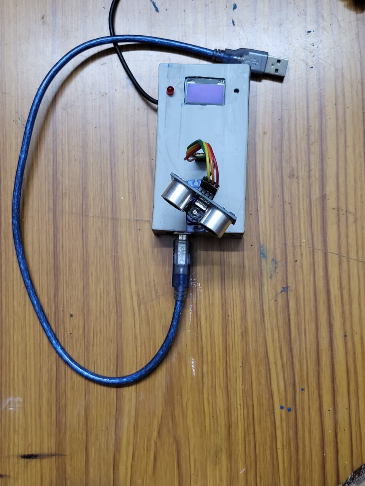

# Arduino Radar System Project 🚨

## Project Overview
This was my first introduction to arduino or microcontrollers and was built in a week. It utilizes an ultrasonic sensor to detect objects, a 9g servo to to make the sensor rotate around 180 degree, an oled display to show position of the detected object and a buzzer to alert when the object gets detected.

